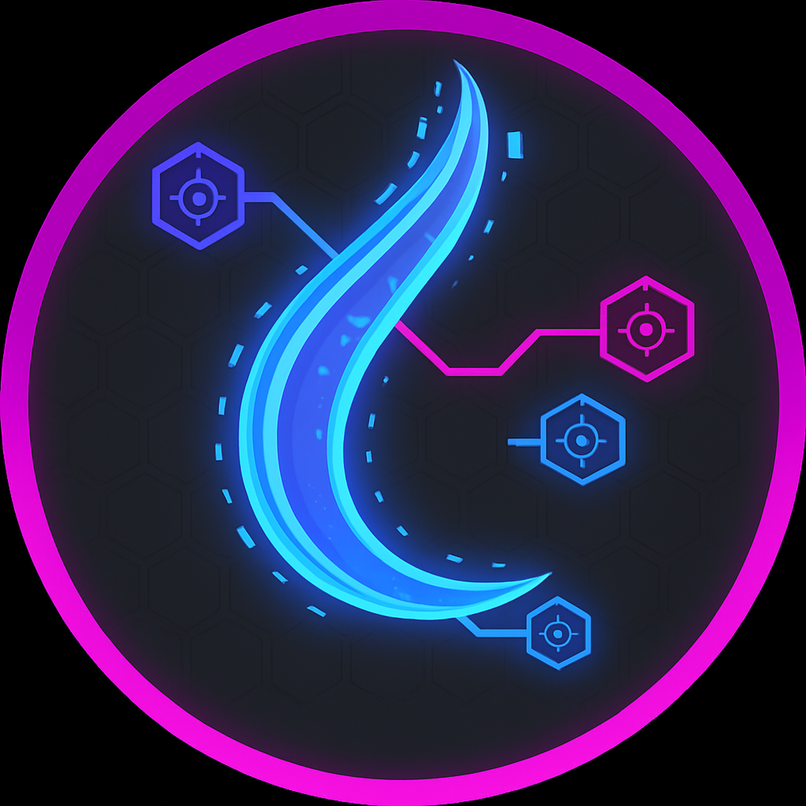

# 🚀 PonLab - Simulador de Redes Ópticas Pasivas

<div align="center">



_Una aplicación de escritorio avanzada para la simulación, diseño y análisis de redes de fibra óptica PON_

[](https://python.org)
[](https://pypi.org/project/PyQt5/)
[](releases)

**🎯 Desarrollado por:** Alex Aravena Tapia • Jesús Chaffe González • Eduardo Maldonado Zamora • Jorge Barrios Núñez

</div>

---

## 📋 Descripción

**PonLab** es una aplicación de escritorio profesional desarrollada en Python que permite simular, diseñar y analizar redes ópticas pasivas (PON - Passive Optical Networks). La herramienta proporciona una interfaz gráfica intuitiva y potente para el diseño de infraestructuras de fibra óptica, con funcionalidades avanzadas de visualización, gestión de dispositivos y análisis de topologías.

## ✨ Características Principales

### 🎨 **Interfaz y Visualización**

- **Canvas Interactivo Avanzado**: Área de trabajo con zoom infinito, pan suave y navegación intuitiva
- **Sistema de Coordenadas Profesional**: Cuadrícula configurable con origen visible y medidas precisas
- **Visualización de Mapas**: Integración con mapas geográficos para ubicación real de equipos
- **Temas Personalizables**: Soporte completo para temas claro y oscuro con estilos profesionales
- **Pantalla de Carga**: Splash screen con progreso de inicialización

### 🔧 **Gestión de Dispositivos**

- **Dispositivos PON Completos**: Soporte para OLT (Optical Line Terminal) y ONU (Optical Network Unit)
- **Drag & Drop Intuitivo**: Arrastra dispositivos desde el panel lateral al canvas
- **Gestión Visual**: Iconos SVG profesionales y representación gráfica detallada
- **Información en Tiempo Real**: Panel de información con coordenadas y datos de dispositivos
- **Selección y Manipulación**: Selección múltiple, movimiento y configuración de dispositivos

### 🔗 **Sistema de Conexiones**

- **Modo Conexión Avanzado**: Activación con tecla `L` para conectar dispositivos
- **Conexiones Visuales**: Líneas de fibra óptica con etiquetas de distancia automáticas
- **Gestión Inteligente**: Creación, eliminación y modificación de conexiones
- **Cálculo de Distancias**: Medición automática de distancias entre dispositivos
- **Validación de Conexiones**: Sistema que previene conexiones inválidas

### 💾 **Gestión de Proyectos**

- **Formato .pon Nativo**: Sistema de archivos propio para topologías PON
- **Auto-guardado Inteligente**: Guardado automático en carpeta temporal
- **Carga y Guardado**: Importación y exportación completa de proyectos
- **Historial de Cambios**: Seguimiento de modificaciones y estados del proyecto
- **Detección de Cambios**: Notificación de trabajo sin guardar

### ⌨️ **Controles y Navegación**

- **Atajos de Teclado Completos**: Más de 15 atajos para navegación rápida
- **Controles de Mouse**: Pan con botón central, zoom con rueda, selección con clic
- **Navegación Inteligente**: Centrado automático, reseteo de vista y enfoque en dispositivos
- **Modo Pantalla Completa**: Maximización del área de trabajo

## 🛠️ Tecnologías y Arquitectura

### **Stack Tecnológico**

- **Python 3.8+**: Lenguaje principal con soporte moderno
- **PyQt5**: Framework de interfaz gráfica profesional
- **PyQtWebEngine**: Motor web para mapas interactivos (opcional)
- **JSON**: Formato de almacenamiento de configuraciones
- **SVG**: Gráficos vectoriales para iconos de dispositivos

### **Arquitectura del Sistema**

```
📦 PonLab Architecture
├── 🚀 Application Layer (main.py)
├── 🎨 UI Layer (ui/)
│   ├── MainWindow (Ventana principal)
│   ├── Canvas (Área de trabajo)
│   ├── SidebarPanel (Panel de dispositivos)
│   ├── InfoPanel (Información en tiempo real)
│   └── MapView (Visualización de mapas)
├── ⚙️ Core Logic (core/)
│   ├── DeviceManager (Gestión de dispositivos)
│   ├── ConnectionManager (Gestión de conexiones)
│   └── ProjectManager (Gestión de proyectos)
└── 🛠️ Utils Layer (utils/)
    ├── ConfigManager (Configuraciones)
    ├── ResourceManager (Recursos)
    └── CoordinateSystem (Sistema de coordenadas)
```

## 📦 Instalación y Configuración

### **Prerrequisitos**

- Python 3.8+ (Recomendado: Python 3.11+)
- Git para clonar el repositorio
- pip (gestor de paquetes de Python)

### **Instalación Rápida**

1. **Clonar el repositorio:**

   ```bash
   git clone https://github.com/alex-itico/PonLab.git
   cd PonLab
   ```

2. **Crear entorno virtual (Recomendado):**

   ```bash
   # Windows
   python -m venv venv
   venv\Scripts\activate

   # Linux/MacOS
   python3 -m venv venv
   source venv/bin/activate
   ```

3. **Instalar dependencias:**

   ```bash
   pip install -r requirements.txt
   ```

4. **Ejecutar la aplicación:**
   ```bash
   python main.py
   ```

### **Instalación con Conda (Alternativa)**

```bash
# Crear entorno conda
conda create -n ponlab python=3.11
conda activate ponlab

# Instalar PyQt5
conda install -c conda-forge pyqt

# Clonar y ejecutar
git clone https://github.com/alex-itico/PonLab.git
cd PonLab
python main.py
```

## 🎮 Manual de Usuario

### **🚀 Inicio Rápido**

1. **Ejecuta la aplicación** con `python main.py`
2. **Arrastra dispositivos** desde el panel lateral al canvas
3. **Conecta dispositivos** presionando `L` y seleccionando dos dispositivos
4. **Navega** usando `C` (centrar), `R` (resetear), mouse wheel (zoom)
5. **Guarda tu proyecto** con `Ctrl+S`

### **⌨️ Atajos de Teclado Completos**

| Atajo    | Función               | Descripción                                         |
| -------- | --------------------- | --------------------------------------------------- |
| `L`      | **Modo Conexión**     | Activa/desactiva el modo para conectar dispositivos |
| `C`      | **Centrar Vista**     | Centra la vista en el origen (0, 0)                 |
| `R`      | **Resetear Vista**    | Restaura zoom y centra la vista                     |
| `Escape` | **Cancelar**          | Cancela operaciones en curso                        |
| `Ctrl+P` | **Panel Componentes** | Muestra/oculta el panel de dispositivos             |
| `Ctrl+G` | **Cuadrícula**        | Muestra/oculta la cuadrícula y origen               |
| `Ctrl+I` | **Panel Info**        | Muestra/oculta el panel de información              |
| `Ctrl+S` | **Guardar**           | Guarda el proyecto actual                           |
| `Ctrl+O` | **Abrir**             | Abre un proyecto existente                          |
| `Delete` | **Eliminar**          | Elimina dispositivos/conexiones seleccionados       |

### **🖱️ Controles de Mouse**

| Acción                   | Función                                   |
| ------------------------ | ----------------------------------------- |
| **Clic Izquierdo**       | Seleccionar dispositivos/elementos        |
| **Clic Derecho**         | Menú contextual con opciones              |
| **Botón Central + Drag** | Pan (mover vista)                         |
| **Rueda del Mouse**      | Zoom in/out                               |
| **Drag & Drop**          | Mover dispositivos, arrastrar desde panel |

### **🔧 Funcionalidades Avanzadas**

#### **Gestión de Dispositivos**

- **Agregar Dispositivos**: Arrastra OLT/ONU desde el panel lateral
- **Mover Dispositivos**: Selecciona y arrastra dispositivos en el canvas
- **Información Detallada**: Panel de información muestra coordenadas y datos
- **Selección Múltiple**: Mantén Ctrl para seleccionar múltiples dispositivos

#### **Sistema de Conexiones**

- **Crear Conexiones**: Presiona `L`, luego selecciona dos dispositivos
- **Etiquetas de Distancia**: Las conexiones muestran distancia automáticamente
- **Validación**: El sistema previene conexiones inválidas
- **Gestión Visual**: Conexiones con colores y estilos diferenciados

#### **Navegación y Vista**

- **Zoom Infinito**: Acércate tanto como necesites sin límites
- **Navegación Suave**: Pan fluido con inercia natural
- **Centrado Inteligente**: `C` centra en origen, `R` resetea completamente
- **Coordenadas en Tiempo Real**: Ve las coordenadas del mouse en tiempo real

## 📁 Estructura del Proyecto Detallada

```
PonLab/
├── 📄 main.py                    # 🚀 Punto de entrada principal
├── 📄 requirements.txt           # 📦 Dependencias del proyecto
├── 📄 SHORTCUTS.md              # ⌨️ Guía completa de atajos
├── 📄 README.md                 # 📖 Documentación principal
├── 📄 .gitignore               # 🚫 Archivos ignorados por Git
│
├── 📁 core/                     # ⚙️ Lógica principal del negocio
│   ├── 📄 __init__.py
│   ├── 📄 device.py            # 🔧 Clases de dispositivos (OLT, ONU)
│   ├── 📄 device_manager.py    # 📱 Gestión de dispositivos
│   ├── 📄 connection.py        # 🔗 Sistema de conexiones
│   ├── 📄 connection_manager.py # 🔗 Gestión de conexiones
│   └── 📄 project_manager.py   # 📁 Gestión de proyectos
│
├── 📁 ui/                       # 🎨 Componentes de interfaz
│   ├── 📄 __init__.py
│   ├── 📄 main_window.py       # 🏢 Ventana principal
│   ├── 📄 canvas.py            # 🎨 Canvas principal de dibujo
│   ├── 📄 sidebar_panel.py     # 📋 Panel lateral de dispositivos
│   ├── 📄 info_panel.py        # ℹ️ Panel de información
│   ├── 📄 map_view.py          # 🗺️ Vista de mapas (MapBox)
│   ├── 📄 map_overlay_toggle.py # 🔘 Botón toggle para mapas
│   └── 📄 splash_screen.py     # 🎬 Pantalla de carga
│
├── 📁 utils/                    # 🛠️ Utilidades y helpers
│   ├── 📄 __init__.py
│   ├── 📄 config_manager.py    # ⚙️ Gestor de configuración
│   ├── 📄 constants.py         # 📊 Constantes de la aplicación
│   ├── 📄 helpers.py           # 🔧 Funciones auxiliares
│   ├── 📄 resource_manager.py  # 📦 Gestor de recursos
│   ├── 📄 validators.py        # ✅ Validadores
│   └── 📄 coordinate_system.py # 📍 Sistema de coordenadas
│
├── 📁 resources/               # 🎨 Recursos gráficos y assets
│   ├── 📁 devices/            # 📱 Iconos de dispositivos
│   │   ├── 🔴 olt_icon.svg    # Icono OLT (Terminal Óptico)
│   │   └── 🔵 onu_icon.svg    # Icono ONU (Unidad Red Óptica)
│   ├── 📁 icons/              # 🖼️ Iconos de la aplicación
│   │   ├── 📄 app_icon.ico    # Icono principal Windows
│   │   ├── 📄 app_icon.png    # Icono PNG
│   │   ├── 📄 app_icon.svg    # Icono vectorial
│   │   ├── 📄 app_icon_16x16.png
│   │   ├── 📄 app_icon_32x32.png
│   │   ├── 📄 app_icon_64x64.png
│   │   └── 📄 app_icon_128x128.png
│   ├── 📁 images/             # 🖼️ Imágenes adicionales
│   ├── 📁 styles/             # 🎨 Archivos de estilo CSS
│   │   ├── 📄 dark_theme.qss  # Tema oscuro
│   │   └── 📄 light_theme.qss # Tema claro
│   └── 📄 map_template.html   # 🌐 Template HTML para mapas
│
└── 📁 temp/                    # 🗂️ Archivos temporales (auto-generado)
    └── 📄 autosave_*.pon      # 💾 Auto-guardado de proyectos
```

## 🚀 Características Técnicas Avanzadas

### **🎯 Rendimiento y Optimización**

- **Renderizado Eficiente**: Canvas optimizado para miles de dispositivos
- **Gestión de Memoria**: Limpieza automática de recursos y garbage collection
- **Carga Diferida**: Carga progresiva de recursos para inicio rápido
- **Auto-guardado Inteligente**: Guardado automático sin interrupciones

### **🔒 Robustez y Confiabilidad**

- **Manejo de Errores**: Sistema robusto de captura y manejo de excepciones
- **Validación de Datos**: Validación completa de entradas y formatos
- **Recuperación de Fallos**: Auto-recuperación de archivos temporales
- **Backup Automático**: Sistema de respaldo automático de proyectos

### **🎨 Personalización y Extensibilidad**

- **Sistema de Temas**: Temas completamente personalizables (claro/oscuro)
- **Configuración Persistente**: Todas las preferencias se guardan automáticamente
- **Arquitectura Modular**: Fácil extensión y adición de nuevas funcionalidades
- **API Interna**: Sistema de events y signals para comunicación entre componentes

## 📸 Capturas de Pantalla

### **🌟 Interfaz Principal**

> _Canvas principal con dispositivos PON, conexiones y panel de información_

### **🗺️ Vista de Mapas**

> _Integración con mapas geográficos para ubicación real de equipos_

### **🌙 Tema Oscuro**

> _Interfaz en tema oscuro para trabajo nocturno_

### **📱 Panel de Dispositivos**

> _Panel lateral con dispositivos disponibles para drag & drop_


## 📋 Roadmap y Funcionalidades Futuras

### **🎯 Versión 1.1 - Simulación Avanzada**

- [ ] **Simulación de Señales**: Cálculo de pérdidas y atenuación
- [ ] **Análisis de Potencia**: Medición de niveles de señal
- [ ] **Reportes Automáticos**: Generación de informes técnicos
- [ ] **Exportación CAD**: Soporte para AutoCAD y formatos técnicos

### **🎯 Versión 1.2 - Colaboración**

- [ ] **Trabajo en Equipo**: Proyectos colaborativos en tiempo real
- [ ] **Control de Versiones**: Historial de cambios en proyectos
- [ ] **Comentarios**: Sistema de anotaciones y comentarios
- [ ] **Sincronización en la Nube**: Backup automático en la nube

### **🎯 Versión 2.0 - Inteligencia Artificial**

- [ ] **Optimización Automática**: IA para optimizar topologías
- [ ] **Detección de Problemas**: Análisis predictivo de fallos
- [ ] **Sugerencias Inteligentes**: Recomendaciones de diseño
- [ ] **Machine Learning**: Aprendizaje de patrones de usuario
